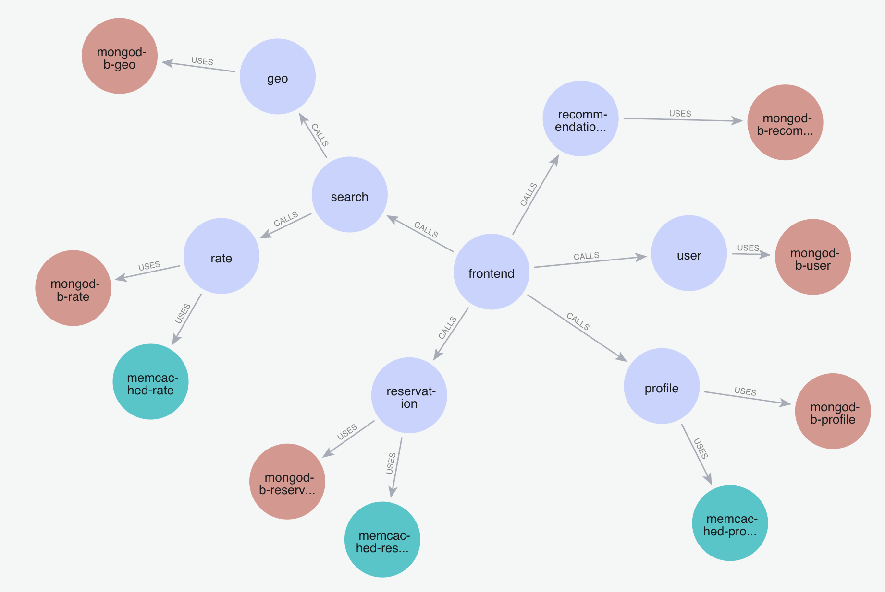

# 🕸️ Service Graph (Neo4j)

This folder contains a simple service dependency graph used by the MCP tools.

- 🔎 Source of truth: Jaeger traces (to find service-to-service CALLS)
- 🧩 Extras: static info for infra dependencies (USES) like databases and caches
- 🗃️ Storage: Neo4j with nodes and relationships

## What it is

A small Neo4j graph that models:

- Services: (:Service {name})
- Datastores/Caches: (:Database), (:Cache)
- Relationships:
  - (:Service)-[:CALLS]->(:Service)
  - (:Service)-[:USES]->(:Database|:Cache)

## How it’s built

1) Use Jaeger to discover service-to-service links (CALLS)
2) Add static dependencies for each service (USES) from your knowledge/config
3) Load all of it into Neo4j using the Cypher file in this folder

## Create it from scratch

- File: `hotel-reservation-datagraph.txt` (Cypher statements)

Steps:

```cypher
// In Neo4j Browser or via neo4j-shell/driver
// Paste and run the contents of hotel-reservation-datagraph.txt
```

After running the queries, you should see a graph similar to the image below.

## Result



Tip: You can automate creation with `DataGraph.create_datagraph()` by pointing it to this file.

## DataGraph library

The `DataGraph` class (see `datagraph.py`) is a tiny helper around Neo4j. It:

- Connects to Neo4j using env vars (NEO4J_URI, NEO4J_USER, NEO4J_PASSWORD)
- Loads the Cypher file to build the graph: `create_datagraph(file_path)`
- Exposes read methods used by MCP tools:
  - `get_services_used_by(service)` → services a service CALLS
  - `get_dependencies(service)` → infra dependencies a service USES (DBs, caches)
  - `get_service_summary(service)` → compact summary string

## Pods vs Services

This is a service graph (logical services and their dependencies). Pods are runtime instances in Kubernetes and aren’t stored in Neo4j.

To map services to pods, the MCP uses the Kubernetes API via our clients:

- `PrometheusAPI.get_pods_from_service(service_name)`
- `LogAPI.get_pods_from_service(service_name)`

Both read the Service’s label selector and list pods that match it. You can also call the MCP tool `get_pods_from_service` to retrieve the list (names and status) for any service in the target namespace.
